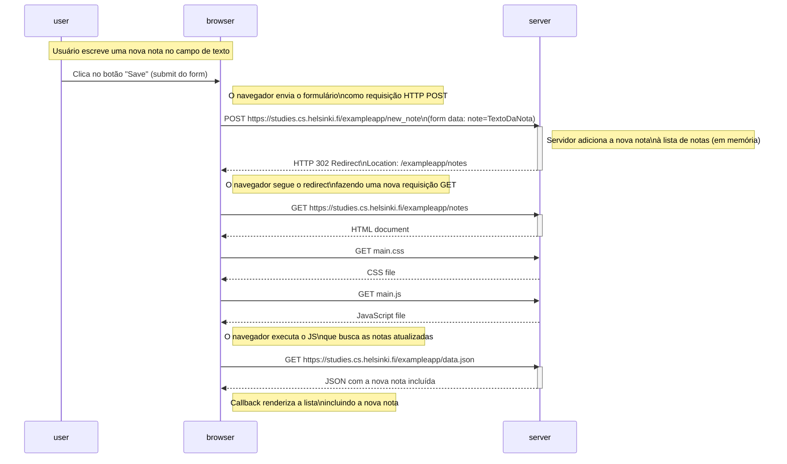

```mermaid
sequenceDiagram
    participant user
    participant browser
    participant server

    Note over user,browser: Usuário escreve uma nova nota no campo de texto

    user->>browser: Clica no botão "Save" (submit do form)

    Note right of browser: O navegador envia o formulário\ncomo requisição HTTP POST

    browser->>server: POST https://studies.cs.helsinki.fi/exampleapp/new_note\n(form data: note=TextoDaNota)
    activate server

    Note right of server: Servidor adiciona a nova nota\nà lista de notas (em memória)

    server-->>browser: HTTP 302 Redirect\nLocation: /exampleapp/notes
    deactivate server

    Note right of browser: O navegador segue o redirect\nfazendo uma nova requisição GET

    browser->>server: GET https://studies.cs.helsinki.fi/exampleapp/notes
    activate server
    server-->>browser: HTML document
    deactivate server

    browser->>server: GET main.css
    server-->>browser: CSS file

    browser->>server: GET main.js
    server-->>browser: JavaScript file

    Note right of browser: O navegador executa o JS\nque busca as notas atualizadas

    browser->>server: GET https://studies.cs.helsinki.fi/exampleapp/data.json
    activate server
    server-->>browser: JSON com a nova nota incluída
    deactivate server

    Note right of browser: Callback renderiza a lista\nincluindo a nova nota
```
