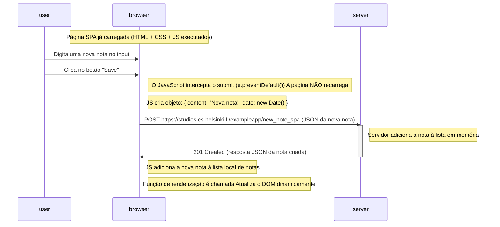

```mermaid
sequenceDiagram
    participant user
    participant browser
    participant server

    Note over browser: Página SPA já carregada (HTML + CSS + JS executados)

    user->>browser: Digita uma nova nota no input
    user->>browser: Clica no botão "Save"

    Note right of browser: O JavaScript intercepta o submit (e.preventDefault()) A página NÃO recarrega

    Note right of browser: JS cria objeto: { content: "Nova nota", date: new Date() }

    browser->>server: POST https://studies.cs.helsinki.fi/exampleapp/new_note_spa (JSON da nova nota)
    activate server

    Note right of server: Servidor adiciona a nota à lista em memória

    server-->>browser: 201 Created (resposta JSON da nota criada)
    deactivate server

    Note right of browser: JS adiciona a nova nota à lista local de notas

    Note right of browser: Função de renderização é chamada Atualiza o DOM dinamicamente
```
