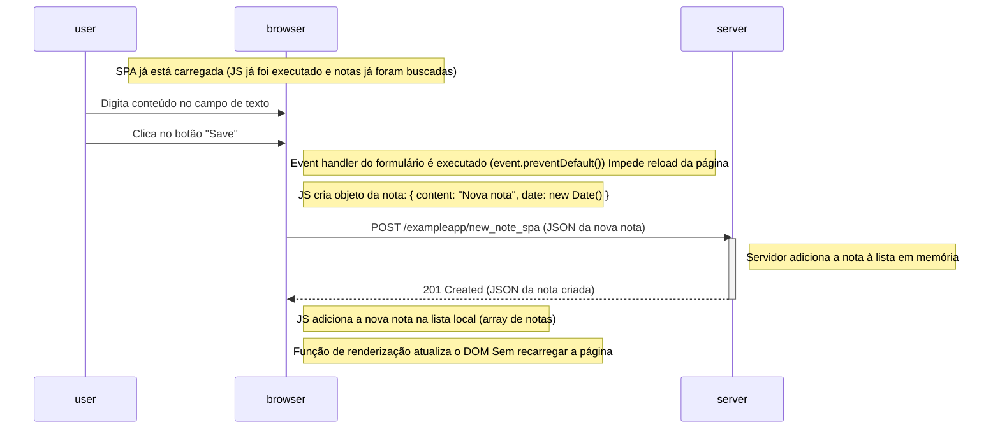

```mermaid
sequenceDiagram
    participant user
    participant browser
    participant server

    Note over browser: SPA já está carregada (JS já foi executado e notas já foram buscadas)

    user->>browser: Digita conteúdo no campo de texto
    user->>browser: Clica no botão "Save"

    Note right of browser: Event handler do formulário é executado (event.preventDefault()) Impede reload da página

    Note right of browser: JS cria objeto da nota: { content: "Nova nota", date: new Date() }

    browser->>server: POST /exampleapp/new_note_spa (JSON da nova nota)
    activate server

    Note right of server: Servidor adiciona a nota à lista em memória

    server-->>browser: 201 Created (JSON da nota criada)
    deactivate server

    Note right of browser: JS adiciona a nova nota na lista local (array de notas)

    Note right of browser: Função de renderização atualiza o DOM Sem recarregar a página
```
